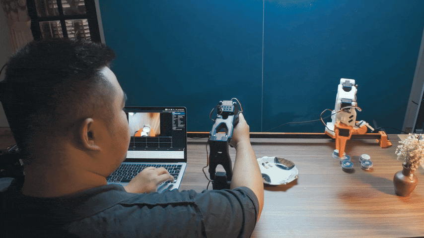
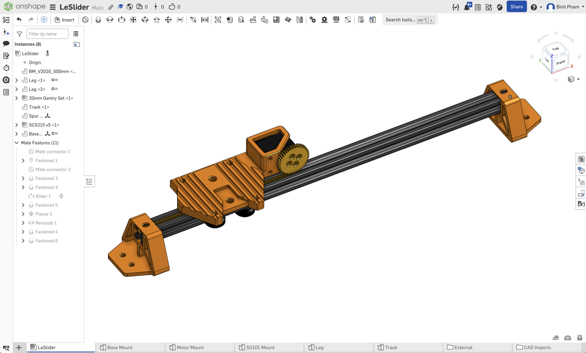

<h1 align="center">LeSlider</h1>

<p align="center">
  <a href="https://github.com/huggingface/lerobot"></a>
  <a href="https://github.com/TheRobotStudio/SO-ARM100"></a>
  <a href="https://docs.astral.sh/uv/"></a>
  <a href="https://www.python.org/downloads/"></a>
  <a href="LICENSE"></a>
</p>

<p align="center">
  
</p>

<p align="center"><b>Mount an SO-101 on a 7th-motor slider.</b></p>

Three teleop modes ship out of the box: keyboard arrows for the slider, the
SO-101 leader arm with its base joint repurposed as the slider throttle, or
any combination you stitch together in a few lines of Python. Print the
parts, run `uv sync`, and you have a 7-DOF arm with linear travel that
records datasets and runs policies the same way a stock SO-101 does.

---

## Build flow

1. [Bill of Materials](#1-bill-of-materials): what to buy
2. [3D-printed parts](#2-3d-printed-parts): what to print
3. [Assembly](#3-assembly): wiring and mounting
4. [Install the plugins](#4-install-the-plugins)
5. [Set the slider motor ID](#5-set-the-slider-motor-id)
6. [Calibrate](#6-calibrate)
7. [Run it](#7-run-it): three teleop modes
8. [Record datasets](#8-record-datasets)
9. [Config reference](#9-config-reference)
10. [Troubleshooting](#10-troubleshooting)

---

## 1. Bill of Materials

Parts you need **in addition to a stock SO-101 kit**. The kit already ships
the six arm STS3215s, brackets, gripper, USB-to-TTL adapter, 12 V PSU, and
cabling, all of which the slider rig reuses.

| Item                                                                                            | Qty    | Notes                                                                                                     |
| ----------------------------------------------------------------------------------------------- | ------ | --------------------------------------------------------------------------------------------------------- |
| [STS3215 Feetech servo](https://www.waveshare.com/wiki/ST3215_Servo) (slider drive)             | 1      | same model as the arm motors, shares the SO-101 bus. Bus cable for the slider is included with the servo. |
| [2020 V-slot aluminum extrusion](https://vi.aliexpress.com/item/1005004784760394.html)          | 1      | any length sized to your reach (300 to 500 mm is typical)                                                 |
| [Gantry plate with V-wheels](https://vi.aliexpress.com/i/32985227943.html?gatewayAdapt=glo2vnm) | 1      | rides the 2020 extrusion as the carriage                                                                  |
| M3 bolts, 20 mm or longer                                                                       | 4      |                                                                                                           |
| M5 bolts, 10 mm or longer, plus matching M5 nuts                                                | 2 sets |                                                                                                           |
| M5 bolts (12 to 16 mm), plus M5 drop-in T-nuts sized for the 2020 V-slot                        | 2 sets | mounts the legs to the extrusion. M5 is the standard thread for 2020 T-nuts.                              |

---

## 2. 3D-printed parts



Source CAD lives on [Onshape](https://cad.onshape.com/documents/7799de322e403a9ba91b0f22/w/05147a3d6feb75b69c2b0fa5/e/832d406a94d20085fd4bee6e?renderMode=0&uiState=69ed28f05b8e6e69be43006a),
where you can spin the assembly, take measurements, or fork it for your own
extrusion length, motor mount, or leg geometry. Exported printable files
live in `3d/`.

The fastest path is `3d/full_print.3mf`: open it in Bambu Studio (or any
slicer that imports `.3mf`) and the whole plate is laid out for you.
Individual parts also live in `3d/separate_components/` if you want to
slice them on a smaller bed or print them one at a time.

Per rig, you need:

| File                                 | Qty       | Notes                                                                                                                                       |
| ------------------------------------ | --------- | ------------------------------------------------------------------------------------------------------------------------------------------- |
| `separate_components/leg.3mf`        | 2         | one at each end of the V-slot extrusion                                                                                                     |
| `separate_components/base_mount.3mf` | 1         | sits on the gantry plate; holds the SO-101 base and the slider servo                                                                        |
| `separate_components/pinion.3mf`     | 1         | press-fits onto the slider servo's output gear; engages the rack track                                                                      |
| `separate_components/track.3mf`      | as needed | drop-in rack segments for the V-slot. Each segment is 20 mm long; print enough to span your extrusion and trim the last one if it overruns. |

---

## 3. Assembly

1. **Print the parts.** Use `3d/full_print.3mf` for the all-in-one plate, or
   slice the individual files in `3d/separate_components/`. Quantities: 2
   legs, 1 base mount, 1 pinion, plus enough 20 mm track segments to span
   your extrusion (cut the last one to length if it overruns).
2. **Lay the rack track.** Slide the printed track segments into the
   top-facing channel of the V-slot extrusion. They sit directly under
   where the base mount will land, so the slider servo's pinion drops
   straight into the rack.
3. **Slide the gantry plate** onto the V-slot so its V-wheels engage the
   side channels. Do this before the legs go on, so the plate can slide in
   from one open end.
4. **Bolt the legs** to each end of the extrusion. Per leg: one M5 bolt
   through the leg into one drop-in M5 T-nut sitting in the V-slot's side
   channel.
5. **Mount the base plate to the gantry.** The gantry plate has two M5
   holes spaced 20 mm apart; align the base mount over them and secure with
   two M5 bolts plus M5 nuts on the underside.
6. **Bolt the SO-101 base** to the base mount with four M3 bolts (20 mm or
   longer) through the four screw holes in the SO-101's base bracket.
7. **Drop the slider STS3215** into the cutout on the base mount, slide the
   printed pinion onto the servo's output gear so it engages the rack
   track, and secure the servo with the screws that ship in its package.
8. **Daisy-chain the slider** onto the SO-101 bus: plug the slider STS3215
   into the spare port on the SO-101's base yaw motor, and let the rest of
   the chain continue through to the SO-101's USB-TTL controller. All seven
   motors share one bus back to the host. The order on the chain doesn't
   matter; only the IDs do.
9. **Power.** Use the same power supply that comes with your SO101.

---

## 4. Install the plugins

This repo is a [uv](https://docs.astral.sh/uv/) workspace: the root
`pyproject.toml` declares `packages/*` as members, so a single `uv sync`
installs `lerobot` along with all three plugin packages editable into one
shared `.venv`.

```bash
git clone https://github.com/pham-tuan-binh/leslider
cd leslider
uv sync
```

That's it. There is nothing on PyPI for these plugins; the workspace is the
only install path. Run lerobot CLIs through `uv run` so they pick up the
workspace venv automatically:

```bash
uv run lerobot-teleoperate ...
uv run lerobot-calibrate ...
uv run lerobot-record ...
```

Or activate the venv once per shell with `source .venv/bin/activate` and
call the same commands directly. Editing any file under `packages/*/src/`
takes effect on the next import; no re-sync needed.

LeRobot's plugin loader picks up the three packages by name prefix
(`lerobot_robot_*` / `lerobot_teleoperator_*`), so once the venv is active
you should see `so101_slider_follower`, `keyboard_slider_leader`, and
`so101_with_slider_leader` available as `--robot.type` / `--teleop.type` choices
on every CLI invocation.

### Find your serial ports

LeRobot ships a port-finder. Unplug the arm it asks about, press ENTER,
plug it back in. Run it once per arm:

```bash
uv run lerobot-find-port
```

Note the paths it prints (`/dev/tty.usbmodem...` on macOS,
`/dev/ttyACM...` on Linux). You'll paste them into the configs below or
pass them on the command line.

### Quick runs with a config file

Every LeRobot CLI accepts `--config_path=<file.yaml>` (parsed by
[draccus](https://github.com/dlwh/draccus)), so once you write a YAML
profile you stop retyping flags. The repo ships ready-made profiles in
`configs/`:

| Profile                           | What it runs                               |
| --------------------------------- | ------------------------------------------ |
| `configs/teleop_keyboard.yaml`    | Slider only, arrow keys                    |
| `configs/teleop_full_rig.yaml`    | SO-101 leader + slider throttle (full rig) |
| `configs/calibrate_follower.yaml` | Calibrate the SO-101 + slider follower     |
| `configs/calibrate_leader.yaml`   | Calibrate the stock SO-101 leader          |
| `configs/record.yaml`             | Record a dataset with the full rig         |

Edit each profile once with your ports and calibration IDs, then:

```bash
uv run lerobot-teleoperate --config_path=configs/teleop_keyboard.yaml
uv run lerobot-teleoperate --config_path=configs/teleop_full_rig.yaml
uv run lerobot-calibrate   --config_path=configs/calibrate_follower.yaml
uv run lerobot-calibrate   --config_path=configs/calibrate_leader.yaml
uv run lerobot-record      --config_path=configs/record.yaml
```

Override any field at the CLI for a one-off:

```bash
uv run lerobot-teleoperate --config_path=configs/teleop_keyboard.yaml \
    --robot.port=/dev/tty.usbmodemSOMETHINGELSE
```

The long-form invocations in the sections below show exactly which flags
each profile sets, in case you need to tweak.

---

## 5. Set the slider motor ID

The slider motor must live on a Feetech ID outside 1..6 (default: 7). The
upstream `lerobot-setup-motors` rejects our `so101_slider_follower` type
(its device whitelist is hardcoded), so the repo ships a small wrapper:

```bash
uv run python scripts/setup_slider_motor.py \
    --port=/dev/tty.usbmodemFOLLOWER \
    --slider-id=7
```

Disconnect every motor except the slider before pressing ENTER. The script
walks the bus in reverse (slider first), so press Ctrl-C after that step;
the SO-101 arm motors come pre-configured from the kit.

After that, daisy-chain everything back together.

---

## 6. Calibrate

Only the arm joints need calibration. The slider runs in continuous-rotation
velocity mode and is skipped.

```bash
uv run lerobot-calibrate \
    --robot.type=so101_slider_follower \
    --robot.port=/dev/tty.usbmodemXXXX \
    --robot.id=my_arm
```

This is the stock SO-101 calibration (middle pose, range-of-motion sweep)
against IDs 1..6. The result lands in
`~/.cache/huggingface/lerobot/calibration/robots/so101_slider_follower/my_arm.json`.

If you also use the SO-101 leader arm (mode B / C below), calibrate it once:

```bash
uv run lerobot-calibrate \
    --teleop.type=so101_leader \
    --teleop.port=/dev/tty.usbmodemLEADER \
    --teleop.id=my_leader
```

---

## 7. Run it

Three teleop modes ship out of the box.

### A. Slider only, keyboard

Drive just the slider with the arrow keys; the arm holds position.

```bash
lerobot-teleoperate \
    --robot.type=so101_slider_follower \
    --robot.port=/dev/tty.usbmodemFOLLOWER \
    --robot.id=my_arm \
    --teleop.type=keyboard_slider_leader \
    --teleop.id=slider_kb
```

| Key                | Effect                                      |
| ------------------ | ------------------------------------------- |
| Left / Right arrow | Drive the slider one direction / the other  |
| Up / Down arrow    | Trim the cruise velocity ±`speed_increment` |
| Space              | Emergency stop (zero velocity while held)   |
| ESC                | Disconnect                                  |

### B. Full arm + slider, leader base drives the slider

Use the `so101_with_slider_leader` teleop. The leader's `shoulder_pan` (base joint)
becomes the slider throttle: under a ±20 dead zone the slider sits still,
above it velocity ramps linearly to the cap. The follower's _own_ base
(`shoulder_pan.pos`) is **not** copied from the leader; it starts at 0 and is
adjusted from the keyboard. Every other arm joint is mirrored normally.

```bash
lerobot-teleoperate \
    --robot.type=so101_slider_follower \
    --robot.port=/dev/tty.usbmodemFOLLOWER \
    --robot.id=my_arm \
    --teleop.type=so101_with_slider_leader \
    --teleop.port=/dev/tty.usbmodemLEADER \
    --teleop.id=my_leader
```

| Key                | Effect                                                                                          |
| ------------------ | ----------------------------------------------------------------------------------------------- |
| Leader base joint  | Drives `slider.vel` (0 inside ±`base_deadzone`, ramps to ±`slider_max_velocity` at ±`base_max`) |
| Left / Right arrow | Trim follower base target by `follower_base_increment`                                          |
| Space              | Reset follower base target to `follower_base_default` (0)                                       |
| ESC                | Disconnect                                                                                      |

### C. Full arm + slider, two-leader Python launcher

Stock SO-101 leader for the arm joints and the keyboard leader for the slider,
merged in Python:

```python
# run_both.py
import time
from lerobot_robot_so101_slider import SO101SliderFollower, SO101SliderFollowerConfig
from lerobot_teleoperator_keyboard_slider import (
    KeyboardSliderLeader, KeyboardSliderLeaderConfig,
)
from lerobot.teleoperators.so_leader import SOLeader, SOLeaderTeleopConfig

robot = SO101SliderFollower(SO101SliderFollowerConfig(
    port="/dev/tty.usbmodemFOLLOWER", id="my_arm", slider_id=7,
))
arm_leader = SOLeader(SOLeaderTeleopConfig(
    port="/dev/tty.usbmodemLEADER", id="my_leader",
))
slider_leader = KeyboardSliderLeader(KeyboardSliderLeaderConfig(
    id="slider_kb", cruise_velocity=1500,
))

robot.connect(); arm_leader.connect(); slider_leader.connect()
try:
    while slider_leader.is_connected:
        action = {**arm_leader.get_action(), **slider_leader.get_action()}
        robot.send_action(action)
        time.sleep(1 / 60)
finally:
    slider_leader.disconnect(); arm_leader.disconnect(); robot.disconnect()
```

---

## 8. Record datasets

Same `lerobot-record` invocation as a stock SO-101, just point at the new
robot type and pick whichever teleop you want:

```bash
lerobot-record \
    --robot.type=so101_slider_follower \
    --robot.port=/dev/tty.usbmodemFOLLOWER \
    --robot.id=my_arm \
    --teleop.type=so101_with_slider_leader \
    --teleop.port=/dev/tty.usbmodemLEADER \
    --teleop.id=my_leader \
    --dataset.repo_id=$USER/leslider_demo \
    --dataset.num_episodes=5 \
    --dataset.single_task="slide and grab"
```

The dataset's action space includes `slider.vel`; observations include
`slider.pos` and `slider.vel` alongside the six arm joints.

---

## 9. Config reference

### `SO101SliderFollowerConfig`

Inherits from `SOFollowerConfig` (port, cameras, `max_relative_target`,
`use_degrees`, `disable_torque_on_disconnect`) and adds:

| Field                 | Default | Description                                                                                |
| --------------------- | ------- | ------------------------------------------------------------------------------------------ |
| `slider_id`           | `7`     | Feetech bus ID for the slider motor. Must not be in 1..6. Validated at construction.       |
| `slider_max_velocity` | `3000`  | Clamp applied to `slider.vel` before writing `Goal_Velocity` (raw sign-magnitude ticks/s). |

### `KeyboardSliderLeaderConfig`

| Field              | Default | Description                                                         |
| ------------------ | ------- | ------------------------------------------------------------------- |
| `cruise_velocity`  | `1500`  | Starting magnitude applied when Left/Right is held, in raw ticks/s. |
| `speed_increment`  | `250`   | Amount Up/Down adds to/removes from the cruise velocity per press.  |
| `min_velocity`     | `100`   | Lower bound of cruise trim.                                         |
| `max_velocity`     | `3000`  | Upper bound of cruise trim.                                         |
| `invert_direction` | `False` | Swap Left ↔ Right if the slider is mounted flipped.                 |

### `SO101WithSliderLeaderConfig`

| Field                     | Default  | Description                                                                                                  |
| ------------------------- | -------- | ------------------------------------------------------------------------------------------------------------ |
| `port`                    | required | Serial port of the SO-101 leader arm.                                                                        |
| `use_degrees`             | `True`   | Leader position unit. `base_deadzone` / `base_max` use the same unit.                                        |
| `base_deadzone`           | `20.0`   | Symmetric dead zone around 0 on the leader base. `\|shoulder_pan\| <= base_deadzone` makes `slider.vel = 0`. |
| `base_max`                | `90.0`   | `\|shoulder_pan\|` at which the slider saturates to `±slider_max_velocity`.                                  |
| `slider_max_velocity`     | `3000`   | Raw-tick velocity cap emitted on `slider.vel`.                                                               |
| `invert_direction`        | `False`  | Swap slider direction relative to leader base sign.                                                          |
| `follower_base_default`   | `0.0`    | Starting follower `shoulder_pan.pos` target (pre-keyboard).                                                  |
| `follower_base_increment` | `5.0`    | Step per Left/Right arrow press, in the follower's unit.                                                     |
| `follower_base_min`       | `-100.0` | Lower clamp for the follower base target.                                                                    |
| `follower_base_max`       | `100.0`  | Upper clamp for the follower base target.                                                                    |

---

## 10. Troubleshooting

- **`ValueError: slider_id=… collides with an SO-101 arm motor`**: pick a
  slider ID outside 1..6 (default is 7).
- **Slider doesn't move.** Check the slider is in velocity mode after
  `configure()`: `bus.read("Operating_Mode", "slider")` should return `1`. If
  torque is off, confirm `disable_torque_on_disconnect` from the previous
  session didn't leave it disabled.
- **Arrow keys do nothing.** `pynput` needs a display server on Linux. If
  `DISPLAY` is unset, the listener is skipped and a warning is logged. Run
  inside a graphical session (or over X/Wayland forwarding).
- **Slider kicks on startup.** The follower writes `Goal_Velocity = 0` inside
  `configure()` _before_ re-enabling torque. If you still see motion, confirm
  the previous session's `disconnect()` zeroed the velocity (it tries to,
  inside a `try/except` so other disconnect work still runs).
- **Leader base feels too sensitive / not sensitive enough.** Tune
  `base_deadzone` and `base_max` on `SO101WithSliderLeaderConfig`. Wider dead
  zone = harder to start moving; smaller `base_max` = full speed reached
  sooner.

---

## License

Apache-2.0. See [LICENSE](LICENSE).
